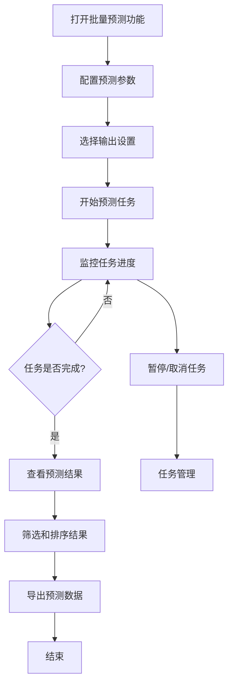

# HIT-大乐透-组合批量预测功能详细设计文档

## 1. 功能概述

HIT-大乐透-组合批量预测功能是基于现有彩票数据分析系统的增强功能，提供智能化、大批量的号码组合预测服务。该功能通过多维度数据分析、机器学习算法和优化的组合生成策略，为用户提供高准确率的预测组合。

## 2. 系统架构设计

### 2.1 整体架构

```
┌─────────────────┐    ┌─────────────────┐    ┌─────────────────┐
│   前端界面层    │────│   业务逻辑层    │────│   数据持久层    │
│ (Electron GUI)  │    │ (Express API)   │    │   (MongoDB)     │
└─────────────────┘    └─────────────────┘    └─────────────────┘
         │                       │                       │
    用户交互界面             预测算法引擎             数据存储管理
    - 参数配置界面           - 组合生成引擎             - 历史数据表
    - 结果展示界面           - 热温冷分析引擎           - 组合缓存表
    - 进度监控界面           - 和值预测引擎             - 预测结果表
    - 导出下载界面           - 区间比分析引擎           - 用户配置表
```

### 2.2 核心组件设计

#### 2.2.1 预测引擎核心模块
- **组合生成器**: 基于C(35,5) × C(12,2)数学模型
- **过滤器引擎**: 多维度条件过滤
- **评分系统**: 智能组合评分排序
- **缓存管理器**: 高性能数据缓存

## 3. 数据库设计

### 3.1 核心数据表结构

#### 3.1.1 大乐透红球组合表 (dlt_red_combinations)
```javascript
{
  id: Number,                    // 组合ID (1-324632)
  numbers: [Number],             // 红球组合 [n1,n2,n3,n4,n5]
  sum: Number,                   // 和值
  zone_ratio: String,           // 区间比 "1:2:2"
  odd_even_ratio: String,       // 奇偶比 "3:2"
  size_ratio: String,           // 大小比 "2:3"
  consecutive_count: Number,     // 连号数量
  span: Number,                 // 跨度值
  ac_value: Number,            // AC值
  created_at: Date,
  updated_at: Date
}
```

#### 3.1.2 大乐透蓝球组合表 (dlt_blue_combinations)
```javascript
{
  id: Number,                    // 组合ID (1-66)
  numbers: [Number],             // 蓝球组合 [b1,b2]
  sum: Number,                   // 和值
  odd_even_ratio: String,       // 奇偶比 "1:1"
  span: Number,                 // 跨度值
  created_at: Date,
  updated_at: Date
}
```

#### 3.1.3 组合热温冷分析表 (dlt_combination_htc_analysis)
```javascript
{
  issue: String,                 // 期号
  red_combination_id: Number,    // 红球组合ID
  hit_count: Number,            // 命中个数 (0-5)
  analysis_type: String,        // 分析类型 'hot'|'warm'|'cold'
  analysis_date: Date,          // 分析日期
  period_range: String,         // 分析期数范围
  weights: {                    // 权重信息
    recent_weight: Number,      // 近期权重
    frequency_weight: Number,   // 频率权重
    trend_weight: Number        // 趋势权重
  }
}
```

#### 3.1.4 批量预测任务表 (batch_prediction_tasks)
```javascript
{
  session_id: String,           // 会话ID
  task_status: String,          // 任务状态: pending|running|completed|failed
  parameters: {                 // 预测参数
    target_issue: String,       // 目标期号
    filters: Object,            // 过滤条件
    exclude_conditions: Object, // 排除条件
    max_combinations: Number    // 最大组合数
  },
  progress: {                   // 进度信息
    current_step: String,       // 当前步骤
    progress_percent: Number,   // 进度百分比
    estimated_time: Number,     // 预计剩余时间(秒)
    start_time: Date,          // 开始时间
    update_time: Date          // 更新时间
  },
  results: {                    // 结果信息
    total_combinations: Number, // 总组合数
    filtered_combinations: Number, // 过滤后组合数
    top_recommendations: Number,   // 推荐组合数
    accuracy_prediction: Number   // 预测准确率
  }
}
```

### 3.2 索引设计

#### 3.2.1 查询性能优化索引
```javascript
// 红球组合表索引
db.dlt_red_combinations.createIndex({sum: 1, zone_ratio: 1});
db.dlt_red_combinations.createIndex({odd_even_ratio: 1, size_ratio: 1});
db.dlt_red_combinations.createIndex({consecutive_count: 1, span: 1});

// 蓝球组合表索引
db.dlt_blue_combinations.createIndex({sum: 1, odd_even_ratio: 1});

// 热温冷分析表索引
db.dlt_combination_htc_analysis.createIndex({issue: 1, red_combination_id: 1});
db.dlt_combination_htc_analysis.createIndex({analysis_type: 1, analysis_date: -1});

// 任务表索引
db.batch_prediction_tasks.createIndex({session_id: 1, task_status: 1});
db.batch_prediction_tasks.createIndex({task_status: 1, "progress.start_time": -1});
```

## 4. 后端API设计

### 4.1 核心API接口

#### 4.1.1 批量预测任务创建API
```javascript
POST /api/dlt/batch-prediction/create

Request Body:
{
  targetIssue: "25001",        // 目标预测期号
  parameters: {
    sumRange: {                // 和值范围
      front: {min: 60, max: 140},
      back: {min: 3, max: 19}
    },
    zoneRatio: ["1:2:2", "2:2:1"], // 区间比过滤
    oddEvenRatio: ["3:2", "2:3"],  // 奇偶比过滤
    excludeHotCombinations: true,   // 排除热门组合
    excludeColdCombinations: false, // 排除冷门组合
    maxCombinations: 10000,        // 最大组合数
    enableBlueCombination: true,   // 是否生成蓝球组合
    htcAnalysisPeriods: 30,       // 热温冷分析期数
    excludeRecentPeriods: 3       // 排除最近期数
  },
  outputOptions: {
    format: "csv",              // 输出格式: json|csv|xlsx
    includeAnalysis: true,      // 包含分析信息
    sortBy: "score_desc"        // 排序方式
  }
}

Response:
{
  success: true,
  data: {
    sessionId: "batch_20241201_001",
    taskId: "task_12345",
    estimatedTime: 300,         // 预计耗时(秒)
    message: "批量预测任务已创建，正在处理中..."
  }
}
```

#### 4.1.2 任务进度查询API
```javascript
GET /api/dlt/batch-prediction/progress/:sessionId

Response:
{
  success: true,
  data: {
    sessionId: "batch_20241201_001",
    status: "running",          // pending|running|completed|failed
    progress: {
      currentStep: "filtering_combinations",
      progressPercent: 65,
      processedCount: 65000,
      totalCount: 100000,
      estimatedTimeRemaining: 120,
      detailedSteps: [
        {step: "initializing", status: "completed", duration: 5},
        {step: "loading_base_combinations", status: "completed", duration: 30},
        {step: "applying_filters", status: "running", duration: 180},
        {step: "htc_analysis", status: "pending", duration: null},
        {step: "scoring_combinations", status: "pending", duration: null},
        {step: "generating_output", status: "pending", duration: null}
      ]
    },
    currentMessage: "正在应用热温冷过滤条件..."
  }
}
```

#### 4.1.3 预测结果获取API
```javascript
GET /api/dlt/batch-prediction/results/:sessionId?format=json&limit=100&offset=0

Response:
{
  success: true,
  data: {
    sessionId: "batch_20241201_001",
    summary: {
      totalCombinations: 8532,
      topRecommendations: 100,
      averageScore: 87.3,
      accuracyPrediction: 76.5,
      generationTime: 285,
      parameters: {...}
    },
    combinations: [
      {
        id: 1,
        redBalls: [5, 12, 18, 25, 33],
        blueBalls: [3, 8],
        scores: {
          overall: 94.5,
          htc_score: 89.2,
          frequency_score: 92.1,
          pattern_score: 88.7,
          sum_score: 96.3
        },
        analysis: {
          sum: {front: 93, back: 11},
          zoneRatio: "1:2:2",
          oddEvenRatio: "3:2",
          htcType: "warm",
          consecutiveCount: 0,
          span: 28,
          acValue: 12
        },
        prediction: {
          confidenceLevel: "high",
          hitProbability: 0.234,
          recommendationRank: 1
        }
      }
    ]
  }
}
```

#### 4.1.4 结果导出API
```javascript
GET /api/dlt/batch-prediction/export/:sessionId?format=csv

Response Headers:
Content-Type: text/csv; charset=utf-8
Content-Disposition: attachment; filename="dlt_predictions_25001.csv"

Response Body:
排序,红球1,红球2,红球3,红球4,红球5,蓝球1,蓝球2,总分,前区和值,后区和值,区间比,奇偶比,热温冷,跨度,AC值,置信度
1,05,12,18,25,33,03,08,94.5,93,11,"1:2:2","3:2","温",28,12,"高"
2,03,15,22,28,31,05,11,92.8,99,16,"1:2:2","2:3","热",28,10,"高"
...
```

### 4.2 辅助功能API

#### 4.2.1 预设配置管理API
```javascript
// 保存预设配置
POST /api/dlt/batch-prediction/presets
{
  name: "标准中奖配置",
  description: "基于历史中奖模式的标准配置",
  parameters: {...}
}

// 获取预设配置列表
GET /api/dlt/batch-prediction/presets

// 删除预设配置
DELETE /api/dlt/batch-prediction/presets/:id
```

#### 4.2.2 历史任务管理API
```javascript
// 获取历史任务列表
GET /api/dlt/batch-prediction/history?limit=20&offset=0

// 删除历史任务
DELETE /api/dlt/batch-prediction/history/:sessionId
```

## 5. 前端界面设计

### 5.1 主界面布局

#### 5.1.1 参数配置面板
```html
<div class="batch-prediction-panel">
  <div class="config-section">
    <h3>基础预测参数</h3>

    <!-- 目标期号选择 -->
    <div class="form-group">
      <label>预测目标期号:</label>
      <select id="targetIssue">
        <option value="auto">自动(下一期)</option>
        <option value="25001">第25001期</option>
        <option value="25002">第25002期</option>
      </select>
    </div>

    <!-- 和值范围设置 -->
    <div class="form-group">
      <label>前区和值范围:</label>
      <div class="range-inputs">
        <input type="number" id="frontSumMin" value="60" min="15" max="175">
        <span>至</span>
        <input type="number" id="frontSumMax" value="140" min="15" max="175">
      </div>
    </div>

    <div class="form-group">
      <label>后区和值范围:</label>
      <div class="range-inputs">
        <input type="number" id="backSumMin" value="3" min="3" max="23">
        <span>至</span>
        <input type="number" id="backSumMax" value="19" min="3" max="23">
      </div>
    </div>
  </div>

  <div class="config-section">
    <h3>高级过滤条件</h3>

    <!-- 区间比选择 -->
    <div class="form-group">
      <label>前区区间比:</label>
      <div class="checkbox-group">
        <label><input type="checkbox" value="0:1:4" checked> 0:1:4</label>
        <label><input type="checkbox" value="1:2:2" checked> 1:2:2</label>
        <label><input type="checkbox" value="2:2:1" checked> 2:2:1</label>
        <label><input type="checkbox" value="1:1:3" checked> 1:1:3</label>
      </div>
    </div>

    <!-- 奇偶比选择 -->
    <div class="form-group">
      <label>前区奇偶比:</label>
      <div class="checkbox-group">
        <label><input type="checkbox" value="1:4" checked> 1:4</label>
        <label><input type="checkbox" value="2:3" checked> 2:3</label>
        <label><input type="checkbox" value="3:2" checked> 3:2</label>
        <label><input type="checkbox" value="4:1" checked> 4:1</label>
      </div>
    </div>

    <!-- 热温冷设置 -->
    <div class="form-group">
      <label>热温冷分析:</label>
      <div class="htc-config">
        <div class="form-row">
          <label>分析期数:</label>
          <input type="number" id="htcPeriods" value="30" min="10" max="100">
        </div>
        <div class="form-row">
          <label>排除类型:</label>
          <div class="checkbox-group">
            <label><input type="checkbox" id="excludeHot"> 排除热号组合</label>
            <label><input type="checkbox" id="excludeCold"> 排除冷号组合</label>
          </div>
        </div>
      </div>
    </div>
  </div>

  <div class="config-section">
    <h3>输出设置</h3>

    <!-- 组合数量限制 -->
    <div class="form-group">
      <label>最大输出组合数:</label>
      <input type="number" id="maxCombinations" value="10000" min="100" max="100000">
    </div>

    <!-- 输出格式选择 -->
    <div class="form-group">
      <label>输出格式:</label>
      <div class="radio-group">
        <label><input type="radio" name="outputFormat" value="csv" checked> CSV表格</label>
        <label><input type="radio" name="outputFormat" value="xlsx"> Excel文件</label>
        <label><input type="radio" name="outputFormat" value="json"> JSON数据</label>
      </div>
    </div>

    <!-- 蓝球组合开关 -->
    <div class="form-group">
      <label><input type="checkbox" id="includeBlueBalls" checked> 包含蓝球组合</label>
    </div>
  </div>

  <div class="action-buttons">
    <button id="startPrediction" class="btn-primary">开始批量预测</button>
    <button id="savePreset" class="btn-secondary">保存为预设</button>
    <button id="loadPreset" class="btn-secondary">加载预设</button>
  </div>
</div>
```

#### 5.1.2 进度监控面板
```html
<div class="progress-panel" style="display: none;">
  <div class="progress-header">
    <h3>批量预测进度</h3>
    <div class="task-info">
      <span id="taskId">任务ID: batch_20241201_001</span>
      <span id="estimatedTime">预计耗时: 5分钟</span>
    </div>
  </div>

  <div class="progress-content">
    <!-- 总体进度 -->
    <div class="overall-progress">
      <div class="progress-bar-container">
        <div class="progress-bar" id="overallProgress" style="width: 0%"></div>
        <div class="progress-text">0%</div>
      </div>
    </div>

    <!-- 详细步骤 -->
    <div class="detailed-steps">
      <div class="step" data-step="initializing">
        <div class="step-icon">✓</div>
        <div class="step-info">
          <div class="step-name">初始化任务</div>
          <div class="step-duration">5秒</div>
        </div>
      </div>

      <div class="step active" data-step="loading_combinations">
        <div class="step-icon">⟳</div>
        <div class="step-info">
          <div class="step-name">加载基础组合数据</div>
          <div class="step-duration">30秒</div>
        </div>
      </div>

      <div class="step" data-step="applying_filters">
        <div class="step-icon">○</div>
        <div class="step-info">
          <div class="step-name">应用过滤条件</div>
          <div class="step-duration">预计180秒</div>
        </div>
      </div>

      <div class="step" data-step="htc_analysis">
        <div class="step-icon">○</div>
        <div class="step-info">
          <div class="step-name">热温冷分析</div>
          <div class="step-duration">预计90秒</div>
        </div>
      </div>

      <div class="step" data-step="scoring_combinations">
        <div class="step-icon">○</div>
        <div class="step-info">
          <div class="step-name">组合评分排序</div>
          <div class="step-duration">预计60秒</div>
        </div>
      </div>

      <div class="step" data-step="generating_output">
        <div class="step-icon">○</div>
        <div class="step-info">
          <div class="step-name">生成输出文件</div>
          <div class="step-duration">预计15秒</div>
        </div>
      </div>
    </div>

    <!-- 当前状态信息 -->
    <div class="current-status">
      <div class="status-message" id="currentMessage">
        正在加载基础组合数据，已处理 65,000 / 324,632 个红球组合...
      </div>
      <div class="status-stats">
        <span>已用时间: <span id="elapsedTime">2分30秒</span></span>
        <span>剩余时间: <span id="remainingTime">2分30秒</span></span>
      </div>
    </div>
  </div>

  <div class="progress-actions">
    <button id="pauseTask" class="btn-warning">暂停任务</button>
    <button id="cancelTask" class="btn-danger">取消任务</button>
  </div>
</div>
```

#### 5.1.3 结果展示面板
```html
<div class="results-panel" style="display: none;">
  <div class="results-header">
    <h3>预测结果</h3>
    <div class="results-summary">
      <div class="summary-stats">
        <div class="stat-item">
          <div class="stat-value" id="totalCombinations">8,532</div>
          <div class="stat-label">总组合数</div>
        </div>
        <div class="stat-item">
          <div class="stat-value" id="avgScore">87.3</div>
          <div class="stat-label">平均分</div>
        </div>
        <div class="stat-item">
          <div class="stat-value" id="accuracyPrediction">76.5%</div>
          <div class="stat-label">预测准确率</div>
        </div>
        <div class="stat-item">
          <div class="stat-value" id="generationTime">4分45秒</div>
          <div class="stat-label">生成耗时</div>
        </div>
      </div>
    </div>
  </div>

  <div class="results-toolbar">
    <div class="toolbar-left">
      <select id="sortBy">
        <option value="score_desc">按分数降序</option>
        <option value="score_asc">按分数升序</option>
        <option value="sum_asc">按和值升序</option>
        <option value="sum_desc">按和值降序</option>
      </select>

      <select id="filterBy">
        <option value="all">显示全部</option>
        <option value="high_confidence">高置信度</option>
        <option value="medium_confidence">中等置信度</option>
        <option value="hot_combinations">热门组合</option>
        <option value="warm_combinations">温号组合</option>
      </select>
    </div>

    <div class="toolbar-right">
      <button id="exportSelected" class="btn-secondary">导出选中</button>
      <button id="exportAll" class="btn-primary">导出全部</button>
    </div>
  </div>

  <div class="results-table">
    <table id="combinationsTable">
      <thead>
        <tr>
          <th><input type="checkbox" id="selectAll"></th>
          <th>排名</th>
          <th>红球组合</th>
          <th>蓝球组合</th>
          <th>总分</th>
          <th>前区和值</th>
          <th>后区和值</th>
          <th>区间比</th>
          <th>奇偶比</th>
          <th>热温冷</th>
          <th>置信度</th>
          <th>操作</th>
        </tr>
      </thead>
      <tbody id="combinationsTableBody">
        <!-- 动态生成的组合数据 -->
      </tbody>
    </table>
  </div>

  <div class="results-pagination">
    <button id="prevPage" class="btn-secondary">上一页</button>
    <span id="pageInfo">第 1 页，共 86 页</span>
    <button id="nextPage" class="btn-secondary">下一页</button>
    <select id="pageSize">
      <option value="50">50条/页</option>
      <option value="100" selected>100条/页</option>
      <option value="200">200条/页</option>
    </select>
  </div>
</div>
```

### 5.2 交互设计

#### 5.2.1 用户操作流程


#### 5.2.2 实时进度更新
```javascript
class BatchPredictionProgress {
  constructor(sessionId) {
    this.sessionId = sessionId;
    this.progressInterval = null;
    this.updateFrequency = 2000; // 2秒更新一次
  }

  startMonitoring() {
    this.progressInterval = setInterval(async () => {
      try {
        const response = await fetch(`/api/dlt/batch-prediction/progress/${this.sessionId}`);
        const data = await response.json();

        if (data.success) {
          this.updateUI(data.data);

          // 任务完成，停止监控
          if (data.data.status === 'completed' || data.data.status === 'failed') {
            this.stopMonitoring();
          }
        }
      } catch (error) {
        console.error('获取进度失败:', error);
      }
    }, this.updateFrequency);
  }

  updateUI(progressData) {
    // 更新总体进度条
    const progressBar = document.getElementById('overallProgress');
    const progressText = document.querySelector('.progress-text');
    progressBar.style.width = `${progressData.progress.progressPercent}%`;
    progressText.textContent = `${progressData.progress.progressPercent}%`;

    // 更新详细步骤状态
    this.updateStepStatus(progressData.progress.detailedSteps);

    // 更新当前状态信息
    document.getElementById('currentMessage').textContent = progressData.currentMessage;
    document.getElementById('remainingTime').textContent = this.formatTime(progressData.progress.estimatedTimeRemaining);
  }

  stopMonitoring() {
    if (this.progressInterval) {
      clearInterval(this.progressInterval);
      this.progressInterval = null;
    }
  }
}
```

## 6. 核心算法设计

### 6.1 智能组合生成算法

#### 6.1.1 多维度过滤算法
```javascript
class CombinationFilter {
  constructor(parameters) {
    this.parameters = parameters;
    this.filters = this.initializeFilters();
  }

  initializeFilters() {
    return [
      new SumRangeFilter(this.parameters.sumRange),
      new ZoneRatioFilter(this.parameters.zoneRatio),
      new OddEvenRatioFilter(this.parameters.oddEvenRatio),
      new HTCAnalysisFilter(this.parameters.htcConfig),
      new PatternFilter(this.parameters.patternConfig),
      new ExclusionFilter(this.parameters.exclusions)
    ];
  }

  async filterCombinations(baseCombinations) {
    let filteredCombinations = baseCombinations;

    for (const filter of this.filters) {
      const startTime = Date.now();
      filteredCombinations = await filter.apply(filteredCombinations);
      const duration = Date.now() - startTime;

      console.log(`${filter.name}过滤完成: ${filteredCombinations.length}个组合, 耗时${duration}ms`);

      // 触发进度更新
      this.onProgressUpdate && this.onProgressUpdate({
        filterName: filter.name,
        resultCount: filteredCombinations.length,
        duration: duration
      });
    }

    return filteredCombinations;
  }
}
```

#### 6.1.2 热温冷分析算法
```javascript
class HTCAnalysisEngine {
  constructor(analysisConfig) {
    this.periods = analysisConfig.periods;
    this.thresholds = analysisConfig.thresholds || {
      hot: 0.7,    // 热号阈值
      warm: 0.3,   // 温号阈值
      // cold: < 0.3 冷号阈值
    };
  }

  async analyzeCombinations(combinations, historicalData) {
    const analysisResults = [];
    const recentData = historicalData.slice(-this.periods);

    for (const combination of combinations) {
      const analysis = await this.analyzeSingleCombination(combination, recentData);
      analysisResults.push({
        combinationId: combination.id,
        ...analysis
      });
    }

    return analysisResults;
  }

  async analyzeSingleCombination(combination, historicalData) {
    const hitCounts = this.calculateHitCounts(combination.numbers, historicalData);
    const hitFrequency = hitCounts.reduce((sum, count) => sum + count, 0) / (this.periods * 5);

    let htcType;
    if (hitFrequency >= this.thresholds.hot) {
      htcType = 'hot';
    } else if (hitFrequency >= this.thresholds.warm) {
      htcType = 'warm';
    } else {
      htcType = 'cold';
    }

    return {
      hitCounts: hitCounts,
      hitFrequency: hitFrequency,
      htcType: htcType,
      score: this.calculateHTCScore(hitFrequency, htcType)
    };
  }

  calculateHitCounts(numbers, historicalData) {
    return numbers.map(num => {
      return historicalData.reduce((count, record) => {
        return record.FrontNumbers.includes(num) ? count + 1 : count;
      }, 0);
    });
  }
}
```

#### 6.1.3 智能评分算法
```javascript
class CombinationScorer {
  constructor(scoringConfig) {
    this.weights = scoringConfig.weights || {
      htc: 0.25,      // 热温冷权重
      frequency: 0.20, // 频率权重
      pattern: 0.20,   // 模式权重
      sum: 0.15,      // 和值权重
      trend: 0.20     // 趋势权重
    };

    this.scorers = this.initializeScorers();
  }

  initializeScorers() {
    return {
      htc: new HTCScorer(this.weights.htc),
      frequency: new FrequencyScorer(this.weights.frequency),
      pattern: new PatternScorer(this.weights.pattern),
      sum: new SumScorer(this.weights.sum),
      trend: new TrendScorer(this.weights.trend)
    };
  }

  async scoreCombinations(combinations, analysisData) {
    const scoredCombinations = [];

    for (const combination of combinations) {
      const scores = await this.scoreSingleCombination(combination, analysisData);
      scoredCombinations.push({
        ...combination,
        scores: scores,
        overallScore: scores.overall
      });
    }

    // 按总分降序排序
    return scoredCombinations.sort((a, b) => b.overallScore - a.overallScore);
  }

  async scoreSingleCombination(combination, analysisData) {
    const scores = {};
    let overallScore = 0;

    for (const [scorerName, scorer] of Object.entries(this.scorers)) {
      const score = await scorer.score(combination, analysisData);
      scores[scorerName] = score;
      overallScore += score;
    }

    scores.overall = Math.min(100, Math.max(0, overallScore));
    return scores;
  }
}
```

### 6.2 性能优化策略

#### 6.2.1 分批处理机制
```javascript
class BatchProcessor {
  constructor(batchSize = 1000) {
    this.batchSize = batchSize;
  }

  async processCombinations(combinations, processor, onProgress) {
    const totalCount = combinations.length;
    const results = [];

    for (let i = 0; i < totalCount; i += this.batchSize) {
      const batch = combinations.slice(i, i + this.batchSize);
      const batchResults = await processor.processBatch(batch);
      results.push(...batchResults);

      // 更新进度
      const progress = Math.min(100, Math.round(((i + this.batchSize) / totalCount) * 100));
      onProgress && onProgress({
        processed: Math.min(i + this.batchSize, totalCount),
        total: totalCount,
        progress: progress
      });

      // 让出执行权，避免阻塞
      await this.sleep(1);
    }

    return results;
  }

  sleep(ms) {
    return new Promise(resolve => setTimeout(resolve, ms));
  }
}
```

#### 6.2.2 缓存优化机制
```javascript
class PredictionCache {
  constructor() {
    this.cache = new Map();
    this.maxCacheSize = 1000;
    this.ttl = 24 * 60 * 60 * 1000; // 24小时
  }

  generateCacheKey(parameters) {
    return JSON.stringify(parameters, Object.keys(parameters).sort());
  }

  get(parameters) {
    const key = this.generateCacheKey(parameters);
    const cached = this.cache.get(key);

    if (cached && Date.now() - cached.timestamp < this.ttl) {
      return cached.data;
    }

    return null;
  }

  set(parameters, data) {
    const key = this.generateCacheKey(parameters);

    // 清理过期缓存
    if (this.cache.size >= this.maxCacheSize) {
      this.cleanExpiredCache();
    }

    this.cache.set(key, {
      data: data,
      timestamp: Date.now()
    });
  }

  cleanExpiredCache() {
    const now = Date.now();
    for (const [key, value] of this.cache.entries()) {
      if (now - value.timestamp >= this.ttl) {
        this.cache.delete(key);
      }
    }
  }
}
```

## 7. 性能指标

### 7.1 预期性能指标

| 指标项 | 目标值 | 说明 |
|--------|--------|------|
| 基础组合生成速度 | ≤ 30秒 | 生成324,632个红球组合和66个蓝球组合 |
| 过滤处理速度 | ≤ 3分钟 | 处理10万个组合的多维度过滤 |
| 热温冷分析速度 | ≤ 2分钟 | 30期历史数据分析 |
| 评分排序速度 | ≤ 1分钟 | 对5万个组合进行评分排序 |
| 总预测时间 | ≤ 8分钟 | 完整批量预测流程 |
| 内存占用 | ≤ 2GB | 处理过程中最大内存使用 |
| 数据库查询响应 | ≤ 100ms | 单次复杂查询平均响应时间 |

### 7.2 可扩展性设计

#### 7.2.1 水平扩展支持
```javascript
class DistributedPredictionProcessor {
  constructor(workerCount = 4) {
    this.workerCount = workerCount;
    this.workers = [];
    this.taskQueue = [];
  }

  async initWorkers() {
    for (let i = 0; i < this.workerCount; i++) {
      const worker = new Worker('./prediction-worker.js');
      worker.on('message', this.handleWorkerMessage.bind(this));
      this.workers.push(worker);
    }
  }

  async distributeTasks(combinations) {
    const chunkSize = Math.ceil(combinations.length / this.workerCount);
    const promises = [];

    for (let i = 0; i < this.workerCount; i++) {
      const chunk = combinations.slice(i * chunkSize, (i + 1) * chunkSize);
      if (chunk.length > 0) {
        promises.push(this.processChunk(this.workers[i], chunk));
      }
    }

    return await Promise.all(promises);
  }
}
```

## 8. 错误处理与监控

### 8.1 错误处理策略

#### 8.1.1 分级错误处理
```javascript
class ErrorHandler {
  constructor() {
    this.errorLevels = {
      FATAL: 0,    // 致命错误，需要停止任务
      ERROR: 1,    // 错误，但可以继续
      WARNING: 2,  // 警告，记录但继续
      INFO: 3      // 信息，正常日志
    };
  }

  handle(error, level = this.errorLevels.ERROR, context = {}) {
    const errorInfo = {
      level: level,
      message: error.message,
      stack: error.stack,
      timestamp: new Date().toISOString(),
      context: context
    };

    // 记录错误
    this.logError(errorInfo);

    // 根据错误级别决定处理方式
    switch (level) {
      case this.errorLevels.FATAL:
        this.handleFatalError(errorInfo);
        break;
      case this.errorLevels.ERROR:
        this.handleError(errorInfo);
        break;
      case this.errorLevels.WARNING:
        this.handleWarning(errorInfo);
        break;
      default:
        this.handleInfo(errorInfo);
    }
  }

  handleFatalError(errorInfo) {
    // 停止所有任务
    this.stopAllTasks();
    // 通知用户
    this.notifyUser('fatal', errorInfo.message);
    // 保存状态
    this.saveTaskState();
  }
}
```

### 8.2 监控与日志

#### 8.2.1 性能监控
```javascript
class PerformanceMonitor {
  constructor() {
    this.metrics = {
      taskDuration: [],
      memoryUsage: [],
      cpuUsage: [],
      dbQueryTimes: []
    };
  }

  startTask(taskId) {
    const startTime = process.hrtime.bigint();
    return {
      taskId: taskId,
      startTime: startTime,
      end: () => {
        const endTime = process.hrtime.bigint();
        const duration = Number(endTime - startTime) / 1000000; // 转换为毫秒
        this.metrics.taskDuration.push({
          taskId: taskId,
          duration: duration,
          timestamp: new Date()
        });
      }
    };
  }

  recordMemoryUsage() {
    const usage = process.memoryUsage();
    this.metrics.memoryUsage.push({
      ...usage,
      timestamp: new Date()
    });
  }

  generateReport() {
    return {
      averageTaskDuration: this.calculateAverage(this.metrics.taskDuration.map(t => t.duration)),
      peakMemoryUsage: Math.max(...this.metrics.memoryUsage.map(m => m.heapUsed)),
      totalTasks: this.metrics.taskDuration.length,
      reportTime: new Date()
    };
  }
}
```

## 9. 用户手册

### 9.1 快速入门

#### 9.1.1 基础使用流程
1. **启动功能**: 在主界面点击"组合批量预测"按钮
2. **配置参数**: 设置预测期号、和值范围、过滤条件等
3. **开始预测**: 点击"开始批量预测"按钮
4. **监控进度**: 在进度面板查看任务执行状态
5. **查看结果**: 任务完成后查看预测组合列表
6. **导出数据**: 选择合适的格式导出预测结果

#### 9.1.2 参数说明

| 参数名称 | 说明 | 推荐值 | 影响 |
|----------|------|--------|------|
| 前区和值范围 | 红球5个号码的和值范围 | 60-140 | 直接影响组合数量 |
| 后区和值范围 | 蓝球2个号码的和值范围 | 3-19 | 蓝球组合筛选 |
| 区间比过滤 | 前区号码在三个区间的分布 | 1:2:2, 2:2:1 | 提高中奖概率 |
| 奇偶比过滤 | 前区奇偶号码比例 | 2:3, 3:2 | 符合历史规律 |
| 热温冷分析期数 | 用于分析的历史期数 | 30期 | 分析准确性 |
| 最大输出组合数 | 最多输出的组合数量 | 10,000 | 处理时间和结果质量的平衡 |

### 9.2 高级功能使用

#### 9.2.1 预设配置管理
```javascript
// 创建预设配置示例
const standardPreset = {
  name: "标准中奖配置",
  description: "基于历史中奖数据分析的标准配置",
  parameters: {
    sumRange: {
      front: {min: 60, max: 140},
      back: {min: 5, max: 17}
    },
    zoneRatio: ["1:2:2", "2:2:1", "2:1:2"],
    oddEvenRatio: ["2:3", "3:2"],
    htcConfig: {
      periods: 30,
      excludeHot: false,
      excludeCold: true
    },
    maxCombinations: 5000
  }
};
```

#### 9.2.2 结果分析技巧
1. **关注高分组合**: 总分90分以上的组合通常具有较高的中奖潜力
2. **平衡热温冷**: 避免全选热号或冷号，温号组合往往表现更稳定
3. **多样化选择**: 不要只选择相似的组合，保持号码分布的多样性
4. **参考历史验证**: 查看类似参数配置的历史准确率
5. **适量购买**: 根据个人情况合理控制购买数量

## 10. 后续优化方向

### 10.1 技术优化
1. **算法优化**: 引入深度学习模型提高预测准确性
2. **性能优化**: 使用GPU计算加速组合生成和分析
3. **缓存优化**: 实现分布式缓存提高查询性能
4. **架构优化**: 采用微服务架构支持更大规模的预测任务

### 10.2 功能扩展
1. **智能推荐**: 基于用户历史偏好自动推荐参数配置
2. **实时更新**: 支持实时数据更新和动态调整预测参数
3. **社区功能**: 添加用户分享和讨论功能
4. **移动端支持**: 开发移动端应用支持随时随地查看预测结果

### 10.3 数据分析增强
1. **多维度分析**: 增加更多分析维度如AC值、跨度、质合比等
2. **趋势预测**: 基于长期趋势进行预测调整
3. **模式识别**: 自动识别中奖号码的潜在模式
4. **概率计算**: 提供更精确的中奖概率计算

---

**文档版本**: v1.0
**最后更新**: 2024年12月1日
**维护团队**: HIT数据分析系统开发组

<function_calls>
<invoke name="TodoWrite">
<parameter name="todos">[{"content": "Explore the current codebase structure", "status": "completed", "activeForm": "Exploring the current codebase structure"}, {"content": "Analyze existing lottery prediction functionality", "status": "completed", "activeForm": "Analyzing existing lottery prediction functionality"}, {"content": "Design the batch prediction feature architecture", "status": "completed", "activeForm": "Designing the batch prediction feature architecture"}, {"content": "Create detailed frontend design specifications", "status": "completed", "activeForm": "Creating detailed frontend design specifications"}, {"content": "Create detailed backend design specifications", "status": "completed", "activeForm": "Creating detailed backend design specifications"}, {"content": "Document the complete feature specification", "status": "completed", "activeForm": "Documenting the complete feature specification"}]